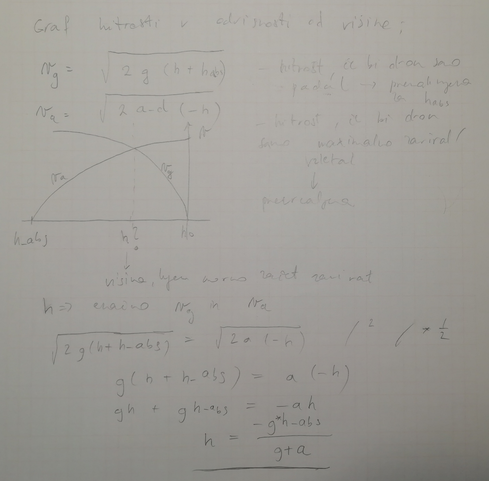
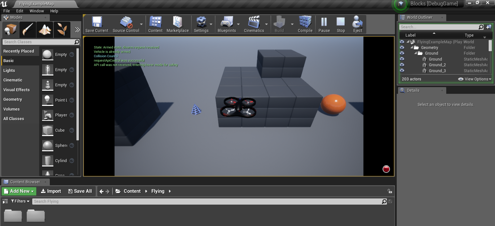

# Drone

## Namestitev projekta

`git clone https://github.com/tspanther/FeriDrone.git`

## Namestitev okolja AirSim

Potrebno je prenesti in zgraditi [projekt AirSim](https://github.com/Microsoft/AirSim).
Potrebno je namestiti Epic Games Launcher, v katerem je nato potrebno namestiti Unreal Engine verzijo 4.18

Potrebno je prenesti in zgraditi vsaj unreal projekt poljubnega okolja (Blocks - minimalističen, Africa, Forest ...). Ta projekt se nato požene.

[Uradna dokumentacija](https://microsoft.github.io/AirSim/) vsebuje natančnejša navodila in povezave.

> Note: Najbolje je, da so okolja znotraj AirSim projekta, ta pa se naj nahaja na poti, ki ne vsebuje presledkov in znakov, ki niso v naboru utf-8.

## Naloge

### Trilateracija, različne oblike

V aplikaciji, ki je napisana v programskem jeziku Python, uporabnik najprej vnese X, Y, Z koordinate treh do deset baznih postaj, razdalje ter čase (prva in druga naloga: razdalje, tretja naloga: čase) predmeta oz. »drona« do vseh vnešenih baznih postaj.
Aplikacija nato naredi matrike z vnesenimi koordinatami, katere predstavljajo točke, kjer je bazna postaja. 
Uporabljamo Gram-Schmidtov postopek, da dobimo nove tocke. Izracunamo vektorje ter njihove vektorske produkte.
Ker smo vektorje tudi normalizirali lahko izracunamo skalarne produkte kateri nam bodo pomagali pridobiti koordinate v kartezicnem koordinatnem sistemu.
Pozicija v kartezicnem prostoru
    `X = (r1**2 - r2**2 + d**2) / (2 * d)`
    `Y = (r1**2 - r3**2 + i**2 + j**2) / (2 * j) - (i / j) * X`
    `Z = math.sqrt(abs(r1**2 - X**2 - Y**2)) * Zn`
Ker pa s pomocjo treh baznih postaj ne vemo tocne pozicije, ker kadar so bazne postaje na isti višini nam to prestavlja dvoumnost. Težavo smo odpravili z četrto referenèno postajo ter oddaljenostjo od nje. (2. Naloga)
Implementirali smo tudi istocasno oddajanje signalov saj za uspešno letenje sinhronizirane podatke. (3. naloga)
Ko pridobimo prvi čas sprejema to predstavlja najkrajšo razdaljo od postaje. Prvi cas(t0) vzamemo kot zacetni cas štoparice. Iz njega dobimo podatek kako dolgo smo morali cakati na preostale signale postaj.
Ta cas pomnožimo z hitrostjo širjenja signala(pf=343m/s), dobimo razliko v oddaljenosti od posamicne postaje.

Zadnji del trilateracije

Pri tej nalogi je šlo predvsem za združitev prejšnjih nalog projekta v celoto in izvedba naloge nad nekim realnim problemom, kjer so bile podane bazne postaje, meritve in časi. Iz teh podatkov je potem bilo potrebno izračunati lokacijo samoletalnika. Ko smo predelali vse meritve, je bilo pričakovano, da kot rezultat dobimo neko trajektorijo letečega objekta. Dobljeno trajektorijo smo potem primerjali z pravimi položaji in s pomočjo RMSE napake izračunali kakšna so odstopanja za različne stopnje prisotnega šuma.

### Komunikacija receiver - Airsim

V sklopu naloge je bilo potrebno pripraviti vmesnik za upravljanje drona v simulatorju Airsim z daljincem (receiverjem).

Za implementacijo programa, ki snema signal controllerja, ga analizira in podatke pošilja simulatorju, smo uporabili Python.

Razlogi zato so bili:

* Airsim ima za Python pripravljen vmesnik (PythonClient), preko katerega je komunikacija s simulatorjem preprosta, delo z mrežnimi vtičniki je prepuščeno PythonClient-u
* Branje in obdelava signala preprosta in intuitivna. Podpora za večnitno delovanje.
* Izkušnje s programskim jezikom, ostale projektne naloge večinoma tudi v Pythonu

#### Uporaba

Skripta, ki skrbi za snemanje receiver signala, parsanje in komunikacijo z AirSim-om, se imenuje `controllerInterface.py`, nahaja se v korenu repozitorija.

Skripta na prejme nobenega parametra.

Dolžino komunikacije je mogoče spreminjati z globalno spremeniljivko `RECORD_SECONDS`.

* Priključi controller in se prepričaj, da je nastavljen ko privzet mikrofon (Windows - Štefko, Niko: Nadzorna Plošča -> Strojna oprema in zvok -> Upravitelj zvočne kartice Realtek -> ..., prepričaj se v Audacity, da je ok)
* Zaženi unreal projekt okolja
* Zaženi skripto

Skripta bo ob koncu komunikacije odprla graf signala in graf parametrov, ki so bili sparsani iz signala.

#### Implementacijske specifike

Algoritem je moral biti dovolj hiter, da lahko signal obdeluje realno-časovno in ni smel blokirati I/O (spuščati vzorcev).

To je bilo doseženo z uporabo niti - ena nit bere signal in ga vstavlja v `queue.Queue`, druga pa od tam jemlje in procesira.

Glaven algoritem procesiranja iz vrste pobere paket, ki je dolg 882 vzorcev (1/50 sekunde pri Fvz 44100Hz). Paket vzebuje in cel PPM pulz - začne in konča se na intervalu, kjer je pavza med posameznima pulzoma.

To dosežemo tako, da najprej preberemo del signala (Fvz vzorcev - 1s), in ga vržemo vstran. Nato preberemo 882 + 200 vzorcev signala, poiščemo fazo in določimo odmik v metodi `find_offset`. Nato odštejemo od odmika čas, kako dolgo smo odmik izračunavali (koliko vzorcev smo ta čas zamudili) in rezultat moduliramo z 882. Dobimo število vzorcev, ki jih moramo prebrati in zavreči, da bo naslednje branje 882-ih vzorcev na pravilnem mestu v PPM signalu.

To iskanje offseta ponavljamo periodično, by default vsakih 20 sekund, da ulovimo primere, ko bi iz kakršnih koli razlogov zamudili kak vzorec v signalu in bi se naši paketi vedno bolj pomikali vstran od željenih intervalov. (Vsakih 20 sekund zavržemo 2 PPM paketa - ni velike škode, boljša stabilnost).

#### Izboljšave

* Objektna implementacija
* Real-time izrisovanje grafa
* Parametrizacija časa kontroliranja

### Autolander

V sklopu naloge je bilo potrebno implementirati algoritem, ki bo na podlagi meritev trenutne višine drona upravljal z vzgonom (gas / throttle / thrust) drona, tako, da bo le-ta pristal s čim manjšo silo (max 1N, 2.5 m/s).

Parametri za inicializacijo autolander-ja so podatki o dronu (masa, maximalni pospešek in neutralna sila vzgona - sila, da dron lebdi - ne pospešuje navzgor ali navzdol). Kasneje autolander prek metode `addHeightMeasurement(self, time, height):` prejema čas ob meritvi in višino, vzgon (thrust) pa nadzoruje z nastavljanjem spremenljivke `self.currentThrust`

Implementacija se nahaja v `autolander.py`

#### Uporaba

Asistenti so nam za testiranje pripravili skripto, ki simulira padanje drona. V njej je mogoče inicializirati autolander z različnimi vhodnimi parametri (vzgonaska sila, masa), lahko se spremeni okolje (gravitacijski pospešek, moč šuma v signalu) in začetni parametri simulacije (začetna višina in hitrost).

Skripta inicializira autolander, mu pošilja višine s šumom in simulira pristajanje drona, na katerega delujeta sili gravitacije in vzgona (propelerjev) drona.

Ob koncu simulacije (pristanek, ali potek 10 sekund) skripta splota simulirano višino drona, filtrirano višino, hitrost drona, gibalno količino drona in vzgonsko silo (thrust) - vse to skozi čas. Izpiše tudi silo in hitrost ob pristanku in čas pristajanja.

#### Implementacija

Odločil sem se za fizikalni pristop k implementaciji, saj se mi je na prvi pogled zdela rešitev preprosta in me je zanimalo, ali sem naredil v kakšni predpostavki logično napako, in se mi je zdel izziv poskusiti implementirati rešitev. Kasneje sem spoznal, da bi bilo veliko bolje ubrati pristop s PID controllerjem, saj bi bil odporen na spremenljivo okolje (veter v navpični smeri, slabenje moči propelerjev).

Implementacija temelji na naslednjih **predpostavkah**;

* po dogovoru z asistentom, sem lahko predpostavljal, da dobim novo meritev višine na konstanten interval `ts`

* če imamo znano višino `h_0` in hitrost `v_0`, lahko izračunamo najnižjo višino `h`, pri kateri je potrebno začeti dron z maso `m` zavirati s silo `F_max`, če na dron ves čas deluje konstantna sila `F_g = g * m`, da bo dronova hitrost natanko 0m/s pri ciljni višini `h_aimed`

Enačbe so sledeče:

izračunamo absolutno višino (pretvorimo trenutno hitrost v višino)
`h_abs = h_0 + v_0**2 / 2 / g`

izračunamo ciljno višino
`h_aimed = h_abs / 20`

`h_abs -= h_aimed`

največja sila, s katero lahko zaviramo dron, pospešek zaviranja
`F_d = F_max - m * g`
`a_d = F_d / m`

izračunamo h , kjer je potrebno začeti zavirati
`h = (g * h_abs / (g + a_d))`

Na podlagi te višine nato izračunamo, kako dolgo še lahko pustimo dron padati - to tistega trenutka nastavljamo thrust na 0, po tistem trenutku pa damo thrust na maximalen.
Na maximalnem ga držimo tako dolgo, da se dron ne ustavi (izračun kako dolgo je potrebno zavirati je opuščen in prepuščen bralcu za vajo). Zaviramo kak trenutek dlje od izračunanega, nato pa nastavimo vzgon na vzgon, ki je malo manjši od nevtralnega, tako da dron zelo počasi pospešuje proti tlem in pristane z nizko hitrostjo.

* začetno višino dobimo tako, da povprečimo prvih nekaj vzorcev (najboljši filter za beli šum), potrebno pa je tudi upoštevati, da pričakovane višine niso enake - niso vse na premici, ki jo dobimo s povprečjem. Potrebno je odšteti višino, za katero bi objekt padel v času od začetka do tega trenutka. Hitrost pa izračunamo tako, da vzamemo prvih 2*N višin, nato pa izračunamo hitrosti kot `v_i = (višine[i] - višine[i+N]) / (N * ts) - g * N * ts`, in povprečimo višine.

* izboljšava; skozi čas stalno posodabljam višine in hitrosti, glede na nove vzorce - moving average.

#### Izboljšave

Navedene v `TODO` komentarju v implementaciji `autolander.py`.

> Implementacija s controllerjem PID nam bo kasneje v projektu bolj koristila. Naloga za čez počitnice :).

### Alternativno upravljanje

Naprava za alternativno upravljanje drona v simulatorju AirSim je tipkovnica.

2 krat po 4 smerne tipke upravljajo throttle in yaw (WS, AD) ter pitch in roll (smerne tipke).

Za simulacijo analognosti upravljanja (tipke so diskretne - 1/0 vhod), sem uporabil za nastavljanje moči spremembe korensko funkcijo, ki dolžino pritiska tipke preslika v vrednosti throttle, pitch ... (dlje kot držiš, večja je vrednost, s tem, da sprva raste hitro - boljša odzivnost kot če bi bila funkcija linearna, nato pa vedno počasneje).

Implementacija se nahaja v `alternativeHandling.py`. Ponovno je mogoče nastaviti trajanje pilotiranja z globalno konstanto `RECORD_SECONDS`.

#### Izboljšave

Enake kot pri pilotiranju s controllerjem.

### Toolchain

V zadnjem sklopu naloge je bilo potrebno implementirati ene vrste vmsenik, v katerega smo integrirali že opravljene naloge projekta, nalogo autolander in komunikacijo iz kontrolerja z AirSim simulatorjem. Zraven integracije je bilo potrebno dodati še način preklapljanja med tema dvema načinoma upravljanja samoletalnika.

Program je zapisan v jeziku Python. Implementacija se nahaja v `toolchain.py`

#### Uporaba

Ko upravljamo naš samoletalnik v AirSim okolju se vse supaj začne z ročnim upravljanjem našega samoletalnika - preko daljinca. Med izvedbo lahko spremenimo način iz ročnega v simuliranega tako, da pritisnemo `W`. Pri tem pristanemo v samodejnem načinu, kjer poskušamo naš samoletalnik s pomočjo Autloander-ja sam pristati.

Med načinoma lahko poljubno cikliramo med izvajanjem simulacije.

#### Implementacija

Pri implementaciji te naloge smo si ogromno pomagali z že zapisano kodo. V prvem koraku je sledila implementacija vseh osnovnih zahtev - pripravili smo sistem, kjer smo vzeli kodo upravljanja samoletalnika z daljincem in integrirali Autolander.

V drugem koraku je bilo potrebno sestaviti mehanizem preklapljanja, kar smo si izposodili od alternitvnega upravljanja z samoletalnikom.

V tretjem koraku je bilo potrebno prvi in drugi korak združiti skupaj. Pri tem je prišlo do rahle modifikacije kode, ki bo opisana v nadaljevanju. Pomemben koncept, ki smo ga tukaj uporabili je večnitno delovanje s katerim zagotavljamo brezhibnost delovanja preklopov. 

Skupaj so prisotne tri ustvarjene niti. Ena nit skrbi za branje in vstavljanje podatkov, druga pa za obdelavo le teh. Koncept uporabljamo pri ročnem upravljanju samoletalnika - ko beremo podatke iz daljinca. Tretja nit preži nad spremembo načina upravljanja ob pritisku tipke.

Sledi le še implementacija logike za to, da vemo v katerem načinu se nahajamo, katerega trenutno izvajamo in skrbimo za ustrezno zaključevanje niti, ter prehode med dvema načinoma.

#### Problemi

Simulirano pristajanje ne deluje kot pričakovano. Težava tiči v tem, da imamo spisan svoj simulator pristajanja, kjer imamo predpostavljen statičen gravitacijski pospešek, AirSim pa ne deluje po takem principu. 

#### Izboljšave

* Implementacija Autolander-ja z PID kontrolerjem. 
* Preselitev spremembe načina upravljanja na numerične tipke; bolj trivialno in več fleksibilnosti v primeru razširitve aplikacije.

### Nacrt za tretji letnik

Osnoven cilj, ki smo si ga zadali, je upravljanje drona s kontrolerjem, ki omogoca preklop v avtonomen nacin, v katerem dron pristane varno, pravokotno na tla. Ob letu bo dron zbiral in posredoval podatke pospeskometra, ziroskopa in magnetometra (nagnjenost, usmerjenost), proximity senzorjev (oddaljenost od tal - tudi v pomoc pri pristajanju, oddaljenosti od 4 postaj - za trilateracijo). Zbrane podatke bomo obdelali / vizualizirali na PCju.

#### Vgrajeni sistemi, SRDS

Pri teh predmetih nacrtujemo podpreti dronovo interakcijo s periferijo in zunanjim svetom.

Za komunikacijo s senzorjem / porpelerji bo va vsako tako interakcijo doloceno opravilo v FreeRTOS.

##### Upravljanje letenja

- dekodiranje signala s controllerja, upravljanje s propelerji na podlagi dekodiranega signala.
- branje s proximity senzorja za visino
- ko prejme dron signal za avtonomen pristanek, upravljanje s propelerji - algoritem za pristajanje (spisan v python, prepis v C)

##### Komunikacija z zunanjim svetom

- branje podatkov s periferije (UART, SPI, I2C);
    - proximity senzorji
    - pospeskometer, ziroskop, magnetometer
- posiljanje podatkov po brezzicni povezavi na PC

#### Multimedia

- zasnovanje paketa/paketov za lightweight in ucinkovit prenos podatkov z drona na pc (stiskanje/posiljanje razlik od prejsnjega stanja?)
- dekodiranje paketov
- format za shranjevanje vseh podatkov o poti - ta datoteka bo vhod v program, ki bo pot vizualiziral

#### Racunalniska grafika

Vizualizacija poti.

- animacija dronove poti, razlicni atributi z barvami
    - lokacija - podatki iz trilateracije
    - vektor smeri - pospeskometer, magnetometer - kam gleda "kljun"
    - hitrost
    - visina

3rd and 1st person view
    - 3rd person view; 
        - uporaba modela drona iz blenderja za prikaz v 3d prostoru
        - prosto premikanje kamere v prostoru ali sledenje kamere objektu
    - 1st person; uporaba vektorja smeri kot vektor gledanja (vektor smeri dobimo iz podatkov iz pospeskometra in magnetometra)
    - preklapljanje med pogledoma

V podatkih pricakujemo veliko suma, zato bo potrebno podatke najprej filtrirati (low-pass filter).

Mozne razsiritve
- trenutno nacrtujemo uporabiti za povrsje neko "demo" teksturo. Mozno bi bilo uporabiti tudi k tlom usmerjeno preprosto kamero, ki bi sluzila za zajemanje realnih tekstur
- trenutno nacrtujemo smatrati povrsje kot ravninsko. mozna (ambiciozna) razsiritev bi bila uporaba LiDAR senzorja za zajemanje realnega povrsja
- trenutno nameravamo implementirati vizualizacijo kot delno interaktivno animacijo (3rd person premikanje kamere), animacija se zgradi iz datoteke, v kateri so zapisane koordinate, usmerjenost in drugi podatki z drona. Mozna razsiritev je realno-casovno vizualiziranje drona, s sprotno obdelavo podatkov.

##### Razdelitev dela pri racunalniski grafiki:

Aljaz:
- uvoz, priprava modela iz blenderja
- priprava scene (demo teksture, kak staticen 3d objekt za orientacijo)

Stefko:
- Hello World aplikacija
- 

Niko:
- obdelava podatkov (filtriranje, interpoliranje)
- 1st person view:
    - osvezevanje upVec, lookAt vektorjev na podlagi toka podatkov iz datoteke
- 3rd person view:
    - osvezevanje campPos, lookAt, upVec vektorjev na podlagi uporabnikovega vhoda (krmiljenja kamere)
    - preklop med nacinoma

