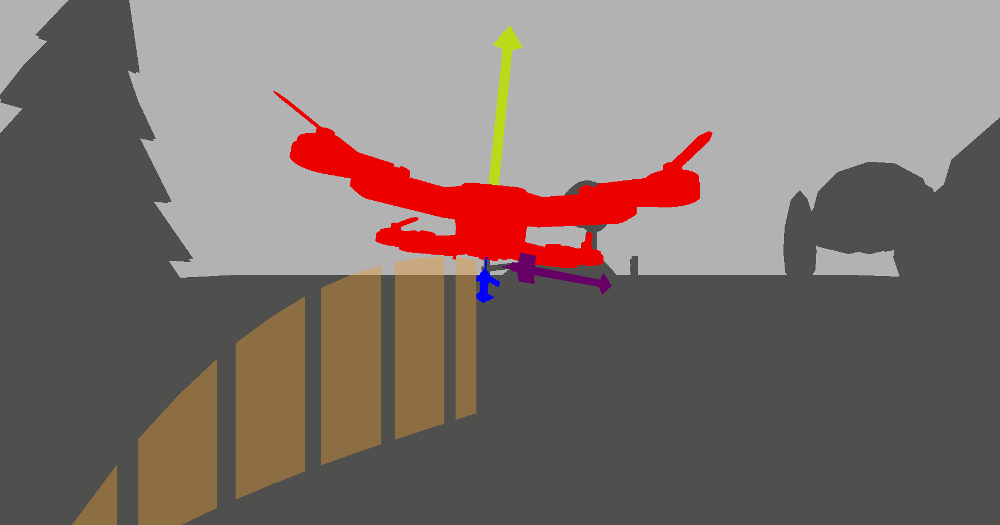
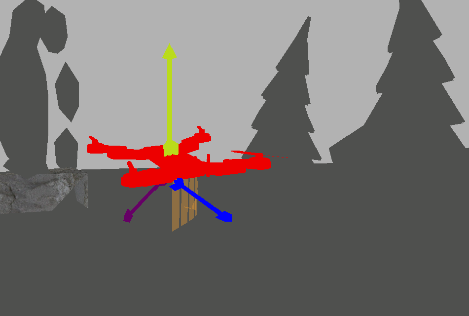
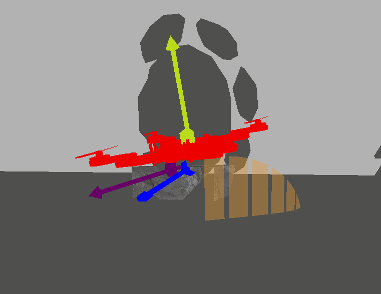

# Porocilo: Vizualizacija drona v 3D sceni

## Izbira tehnologije

C++, plain OpenGL

- najbolje poznana
- predpripravljeno veliko kode iz vaj (manipulacija objektov in kamere, nalaganje objektov, tekstur)
- zadostuje vsem ciljem, ki smo si jih zadali

## Opravljeno delo

### Objekti, kamera

- nalaganje scene in drona
- 3rd person kamera
    - premikanje po oseh x, z v smeri lookAt (hoja v smeri gledanja)
    - seemless rotiranje (premik miske v levo / desno -> yaw, gor / dol -> pitch)
- 1st person kamera
    - sledenje dronu



### Dronova pot in prikaz atributov

- nalaganje dronovih pozicij in rotacij iz datoteke
- korakanje skozi pozicije in rotacija

- prikaz atributov; puscice
    - lookAt
    - upVec
    - hitrost



- trajektorija



``` C++
std::vector<float> novaTrikotnika = {
    previousPosition.x, previousPosition.y, previousPosition.z
    currentPosition.x, currentPosition.y, currentPosition.z
    previousPosition.x, 0.0, previousPosition.z
    currentPosition.x, currentPosition.y, currentPosition.z
    previousPosition.x, 0.0, previousPosition.z
    currentPosition.x, 0.0, currentPosition.z
};
```

## Cilji do zakljucka

### Teksturiranje scene in drona

Objekte teksturiramo v C++, vendar objekti samo nimajo podanih koordinat tekstur -> vedno je koordinata teksture v vsakem ogljiscu (u, v) = (0, 0).

Testna scena je trenutno en sam objekt - glede na implementacijo nalaganja obj datotek, nam bo najlazje sceno razcleniti na vec obj datotek (modifikacija v blenderju, izvoz) in naloziti vsak objekt s svojo teksturo posebej (nimamo logike za uporabo vec tekstur na razlicnih delih objekta).

### Izboljsava 1st person kamere

Kamera trenutno potuje za dronom, se pa ne rotira skupaj z njim.

``` C++
camPos = dronePos + glm::vec3(0, 0, -3); // ne povsem realisticen - tocno za dronom samo ko dron ni nagnjen
lookAt = glm::vec3(0.0, 0.0, -1.0); // staticen
camUp = glm::vec3(0.0, 1.0, 0.0); // staticen
```

zelimo doseci:

``` C++
camPos = dronePos - 3.0f * glm::normalize(lookAt); // realisticno - za dronom ne glede na nagib in usmerjenost
lookAt = todo(pitch, yaw);
camUp = todo(roll);
```

### Sencenje

Koda iz vaje 5...

#### Sence

https://learnopengl.com/Advanced-Lighting/Shadows/Shadow-Mapping

### Real-time branje podatkov iz toka, prikazovanje

- Wifi vmesnik
- filtriranje podatkov (low pass)

### Trajektorija nagnjenosti - platojev

'stripes 3d flight'

### Opcijsko: Igra

- fizikalni model
    - https://github.com/bulletphysics
- dekodiranje PWM signala s controllerja
    - IPC s Python skripto
...
- dodatni ukazi zraven usmerjanja (streljanje, metanje bomb) - kodirani v preostalih kanalih

### Menu

Uporabniski vmesnik za izbiro nacina delovanja aplikacije (preprost)

App modes:
- Real-time renderiranje iz toka podatkov
- animacija iz datoteke .flight (shranjen not podatkov z drona)
- (Igra)

Drugo:
- obkljukanje/odkljukanje atributov za prikaz