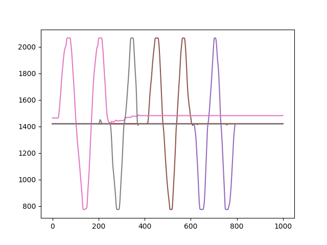
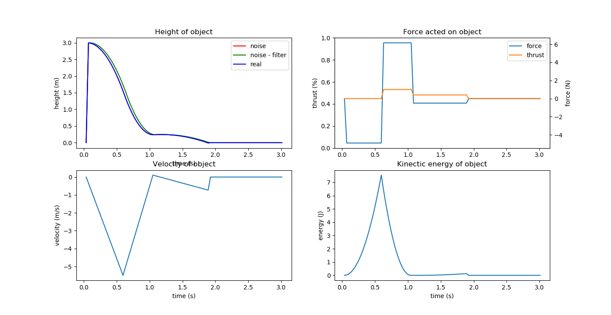

# Tehnicna dokumentacija

## Shema

to add

## Funkcionalnosti

### Merjenje podatkov

#### Nagib

Nagib in usmerjenost merimo s pomocjo senzorjev pospeskometra (LSM303DLHC) in ziroskopa (L3GD20), do katerih dostopamo s komunikacijskima protokoloma I2C in SPI.

Frekvenci merjenja podatkov z obeh senzorjev sta 50Hz.

Podatke dekodiramo z odprtokodnim algoritmom [Madgwick](https://x-io.co.uk/open-source-imu-and-ahrs-algorithms/).

#### Visina

Visino merimo s senzorjem VL53L0X. Zaradi tezav s portom vmesnika za dostop do senzorja smo sistemu dodali dodaten MCU Arduino Uno, saj je za platformo Arduino port za senzor ze spisan in prosto dostopen.

Arduino komunicira s senzorjem preko protokola I2C, arduino pa z naso ploscico discovery preko protokola UART.

Frekvenca meritev je 33Hz.

### Dekodiranje in generiranje PPM

#### Zajem in dekodiranje

Za dekodiranje signala PPM uporabljamo casovnik z dvema kanaloma. V prekinitveni rutini `TIM1_CC_IRQHandler` iz kanala 1 preberemo vrednost - pulse, ki je casovni interval z dolzino to val, ki smo ga pravkar zajeli.

Casovnikova kanala 1 in 2 sta na pinih PE9 in PE11. Fizicno je povezan na receiver pin PE11, seveda ne pozabimo na GND.

Pulzi so lahko dveh dolzin

- pulz, v katerem je zakodiran kanal PPM-ja (teh je 8 na paket); dolzina 800 - 2050 inkrementov casovnika
- pulz, med dvema posamicnima paketoma PPM-ja; dolzina 6000 - 14000 inkrementov casovnika

Algoritem dekodiranja valov je sledec
- cakamo na pulz med posamicnima paketoma
- od takrat dalje hranimo 8 pulzov v polje
- signaliziramo opravilu za generiranje PPM, da je nov paket dekodiran
- spustimo nov dolg val

#### Generiranje PPM

##### Autolander

Vklop autolanderja dosezemo z kanalom 8 - SWD. Ko je kanal na high (pulz dolzine nad 2000), inicializiramo autolander.

Algoritem je preprost in temelji na fizikalnem modelu. Na podlagi meritev visin in konstant kot so teza drona, maksimalen vzgon in nevtralen vzgon, autolander v prvih nekaj trenutkih od inicializacije (0.2s) pripravi 'schedule' - urnik.

Urnik je sestavljen iz treh delov
- izklop motorjev, prosti pad (se pricne takoj, ko vklopimo autolander)
- vklop motorjev na 100% (zadnji trenutek, v katerem lahko zacnemo zavirati) - pripravi autolander
- znizanje delovanja motorjev na nivo, malo pod nevtralnim (trenutek, ko 100% delovanje motorjev ustavi dron tik nad tlemi, sledi le se pocasen pristanek) - traja do pristanka ali predcasnega izklopa autolanderja

Autolander je mogoce kadarkoli izklopiti in pridobiti popolno kontrolo drona. Prav tako je usmerjanje drona mogoce med delovanjem autolanderja - autolander modulira le kanal 'throttle'.

###### Validacija

Uporabili smo simulator `gravitySim`, ki smo ga dobili v drugem letniku.

Python implementacijo razreda Autolander smo spremenili takole; namesto, da je algoritem tekel v python kodi, smo preko comport-a posiljali na MCU (kjer je bil autolander vklopljen) podatke o visini, ki so nadomestili meritve visine, predelana metoda za upravljanje autolanderja pa je preko comport-a nazaj sporocala moc vzgona letalnika, ki jo je Autolander class posredoval simulaciji.

Rezultati so bili enaki, kot implementacija autolander algoritma v Python-u iz prejsnjega leta - s cimer smo dokazali pravilnost porta algoritma.

##### Generiranje signala

Glede na stanje autolanderja, generiramo signal, ki je bodisi enak vhodnemu (izklopljen autolander), ali pa enak vhodnemu z moduliranim throttle kanalom (vklopljen autolander).

Signal generiramo na GPIO pin PB4, ki ga povezemo na ploscico s cleanflight firmware-om na pin PB8.

Signal generiramo s timerjem tako, da ob prelivu vrednosti preklopimo vrednost GPIO pina in nastavimo naslednjo periodo (autoreload), ob kateri naj timer znova prelije.

V prekinitveni rutini `HAL_TIM_PeriodElapsedCallback` preverimo, ali je prelil pravi timer in
- togglamo vrednost pina
- nastavimo periodo na; dolzino PPM pavze (517 inkrementov) ali naslednji PPM pulz (eden izmed 8 kanalov ali dolg pulz med paketoma). Nastavitev z makrom: `__HAL_TIM_SET_AUTORELOAD(&htim3, delay[delay_idx])`

> V polju `delay` so prepletene vrednosti; pavza-kanal-pazva-...-pulz_med_paketi. To polje polni opravilo, ki na podlagi dekodiranega PPM signala upravlja autolander in na podlagi autolanderjevega schedula modulira throttle kanal.

###### Validacija

Generiran signal smo validirali tako, da smo namesto na F3 ploscico s cleanflight firmware-om, povezali izhod PPM signala na drugo ploscico F4, na kateri je tekel enak dekoder, kot da uporabljamo za dekodiranje signala iz receiverja.

Preko comport-a smo posiljali na racunalnik signal, ki smo ga nameravali kodirati na prvi F4, in iz druge F4 signal, ki smo ga dekodirali. Signala se nista razlikovala.

Da bi se izognili nesrecnemu nakljucju, da smo naredili inverzno napako pri kodiranju in dekodiranju, smo preverili pravilnost signala tudi z logicnim analizatorjem, ki smo ga priklopili na izhodni pin receiverja in izhodni pin kodirne ploscice F4.

### Komunikacija dron - PC

Zastavili smo si implementirati 2 nacina prenosa podatkov iz razvojne ploscice na osebni racunalnik - preko USB in preko Wifi modula esp8266.

Globalno smo inizializirali buffer, v katerega opravila, ki opravljajo senzoriko (in tudi opravila, s katerih zelimo karkoli posredovati na racunalnik za analizo in vizualizacijo leta - schedule autolanderja) dajejo podatke.

Vsako opravilo ima svoj paket s svojo glavo, ki sluzi za dekodiranje. Headerji so sledeci;

0xAA 0xAB - nagib
0xAA 0xAE - PWM_RAW
0xAA 0xAF - PWM_GEN
0xAA 0xA1 - altitude
0xAA 0xA3 - autolander debug

Spisali smo python skripto, ki poslusa na comportu in dekodira pakete (`ST\python_demos\comport_all.py`). CSV, ki ga skripta generira se uporabi pri vizualizaciji.

todo: plot nagibov, plot visin

Stabilne komunikacije z moduli Wifi nam ni uspelo usposobiti. Povezava med moduloma se redko vzpostavi pravilno in deluje kratek cas, hkrati pa se izguljajo paketi in ne prispejo v celoti.

### FreeRTOS

Za lazje vodenje period posameznih opravil, smo uporabili FreeRTOS.

Funkcionalnosti drona smo razdelili na naslednja opravila:

- `merjenjeNagiba`: zajemanje s senzorjev pospeskometra in ziroskopa, dekodiranje podatkov, dodajanje podatkov v buffer
- `pilotiranje`: upravljanje z autolanderjem, moduliranje throttle kanala v autolander nacinu, pripravljanje `delay` polja za timer, ki generira PPM signal
- `posiljanjePodatkov`: opravilo, ki na podlagi izbranega nacina - Wifi ali USB prazni buffer in posilja podatke
- `altitudeMeasure`: opravilo, ki preko UART-a komunicira z Arduino MCU-om.
